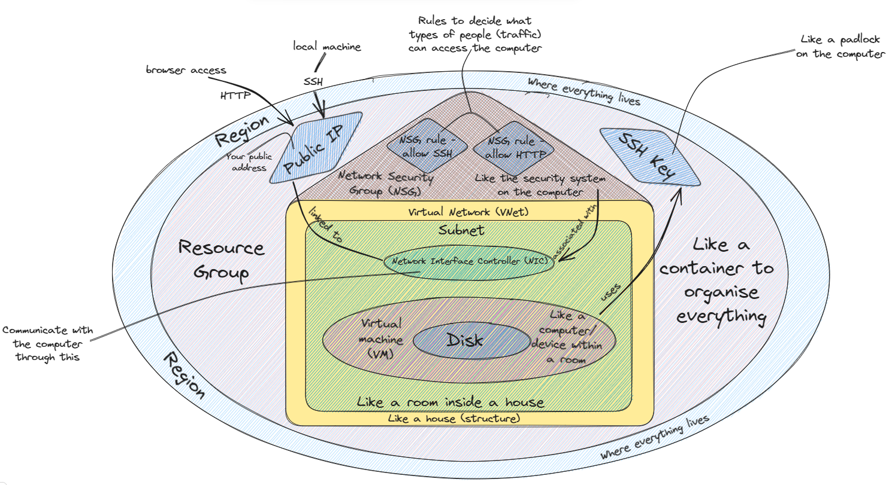

# Virtualisation

## What is Virtualisation?
In a nutshell, virtualisation is the process of creating a software-based representation of something rather than a physical one.

This can include virtual computer hardware platforms, virtual storage devices and virtual computer networks.

## What is a Virtual Machine (VM)?

A virtual machine is a simulated computing environment.

It is a software-based version of a computer that behaves like an actual computer.

## Where can VMs be run?

VMs can be run on a physical machine.

## What determines how many can run?

